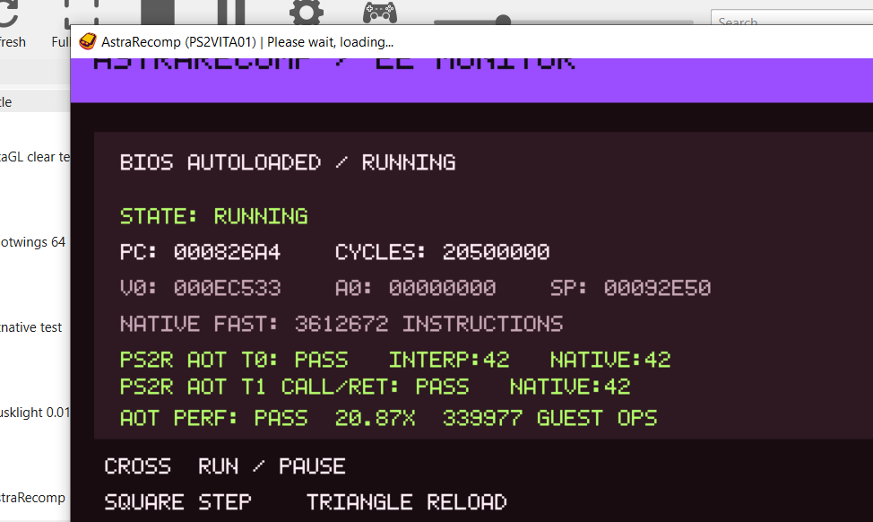

# AstraRT performance-validation gate


Offline translation is only useful if it buys enough CPU time to offset the
Vita's performance deficit. This milestone tests that premise before broad PS2
peripheral coverage consumes years of engineering effort.

## What is measured

`tools/make_aot_benchmark_elf.py` creates a deterministic PS2 ELF. The normal
AstraRT generator translates it; the benchmark does not contain a hand-written
native substitute. The same seeded workload then runs through both the portable
EE interpreter and the generated AstraRT package.

The workload contains integer ALU operations, 64-bit `DADDU`/`DSUBU`, packed MMI
`PAND`/`PXOR`/`POR`, 32- and 64-bit loads/stores, taken branches and delay slots,
direct calls, indirect returns, a 64-byte copy loop, three multiply-heavy
matrix-style terms, and a hot outer loop. It compares the final register state,
PC, cycle count, memory checksum, and stop reason.

The default run performs 4,096 outer iterations. Each path is warmed once and
then measured five times. Setup, allocation, checksumming, report writing, and
screen rendering are outside the timed regions; the reported duration is the
median sample.

## PC-side configuration probe

For quick keep/discard comparisons between generator configurations, use a
Release build and the host CLI:

```sh
cmake --build build-trace-release --target aot_benchmark -j2
./build-trace-release/aot_benchmark 20000 9
```

It reports exact match status, guest instructions, interpreter/AOT median
microseconds, and speedup. It also runs the synthetic `0x3000 -> 0x3020` chain
and reports `trace_probe_us`, `trace_entries`, `trace_horizon_fallbacks`, and a
deterministic checksum. Compare otherwise identical Release builds with direct
traces disabled and enabled; physical Vita timing remains authoritative.

The 2026-09-03 x86 Release comparison (three process runs, 20,000 iterations,
nine samples per run) measured a 10,021 us legacy median and a 9,962 us fused
median. Both produced checksum `E4F52905FF571383`; fused runs recorded 20,000
entries and six horizon fallbacks. The approximately 0.6% delta is within likely
host noise, so this validates trace selection and accounting but is not evidence
of a material target-device speedup.

## Vita3K gate

Install and launch the VPK in Vita3K first. A valid run shows `AOT PERF: PASS`
and creates:

```text
ux0:data/ps2vita/benchmark.txt
```

Vita3K is the functional gate: it validates the Vita executable, generated ARM
code, runtime contract, and report path. Its speed ratio is **not** a hardware
result because the host computer is executing an emulated Vita environment.

Current Vita3K correctness evidence:



## Physical-Vita decision

Run the identical VPK on a homebrew-enabled Vita, reboot once to reduce stale
state, launch AstraRecomp, wait for `AOT PERF: PASS`, and copy
`benchmark.txt` using VitaShell. Keep the complete file with the VPK commit hash
and Vita model/clock configuration.

Use these as investigation thresholds, not compatibility promises:

| Native speedup over interpreter | Interpretation |
| --- | --- |
| 5x or greater | The offline/native premise is strongly worth pursuing |
| 3x to 5x | Promising, but profile dispatch and memory representation |
| 1.5x to 3x | Reconsider the generated-code/runtime architecture early |
| Below 1.5x | The current premise needs a material architectural change |

A synthetic CPU workload cannot predict a complete game's GS, VU, IOP, audio,
or synchronization cost. It answers the narrower and essential question: does
generated AstraRT code materially outperform this project's interpreter on the
actual target CPU?
